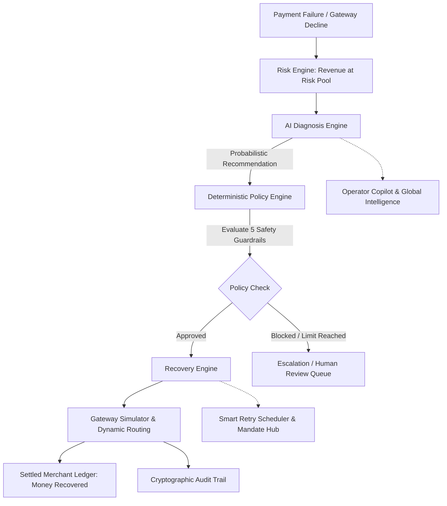

# 🛡️ RevenueShield — Autonomous Revenue Recovery & Payment Intelligence

> **Autonomous, policy-bounded revenue recovery intelligence that detects payment degradations, diagnoses root causes, determines optimal interventions, and recovers lost revenue across checkouts, recurring mandates, and B2B receivables.**

[](backend/tests/)
[](frontend/)
[](frontend/tsconfig.json)
[](backend/requirements.txt)
[](https://fastapi.tiangolo.com)
[](LICENSE)

---

## 🌐 Live Production Deployments

| Service | Environment | URL |
| :--- | :--- | :--- |
| **Frontend Web App** | Vercel Production | [**https://recover-ai-nu.vercel.app**](https://recover-ai-nu.vercel.app) |
| **Backend REST API** | Render Production | [**https://recover-ai-1-jwzz.onrender.com**](https://recover-ai-1-jwzz.onrender.com) |
| **Interactive API Docs** | Swagger / OpenAPI | [**https://recover-ai-1-jwzz.onrender.com/docs**](https://recover-ai-1-jwzz.onrender.com/docs) |

---

## 🏛️ Executive Summary & The Problem

Over **$440B+** is lost globally each year to false payment declines, unoptimized retry timing, mandate debit bounces, network timeouts, and overdue corporate receivables. 

* **Traditional Payment Processors** rely on *dumb retry loops* that blindly re-attempt charges at fixed intervals, triggering excessive gateway penalty fees, card scheme flags, and customer friction.
* **Unconstrained AI / LLMs** cannot be trusted with actual money movement due to stochastic hallucinations, regulatory non-compliance, and lack of deterministic bounds.

### **The RevenueShield Solution: Probabilistic AI + Deterministic Safety Guardrails**
RevenueShield completely decouples **recovery formulation** from **execution authority**:
1. **AI Diagnosis Engine (Probabilistic)**: Analyzes issuer decline codes, customer historical liquidity timing, network telemetry, and salvage propensity to propose high-yield recovery playbooks.
2. **Policy Engine (Deterministic)**: Enforces immutable financial safety guardrails that **AI can NEVER bypass** (e.g., hard stop after 3 attempts, mandatory 24h cooldown windows, customer opt-out verification, max exposure bounds).
3. **Recovery Engine (Execution Rails)**: Executes only verified actions across payment gateways (Smart Retries, UPI Autopay sequencing, Timed Reminders, Dynamic Routing).

---

## 🔄 The 7-Stage Autonomous Recovery Pipeline

The core operational lifecycle transforms failed payments into settled merchant revenue through a 7-stage causal flow:

```
PAYMENT FAILURE
      ↓
REVENUE AT RISK
      ↓
AI DIAGNOSIS
      ↓
ACTION PROPOSAL
      ↓
POLICY CHECK
      ↓
RECOVERY
      ↓
MONEY RECOVERED
```

| Stage | Title | Architectural Definition |
| :---: | :--- | :--- |
| **01** | **Payment Failure** | Ingestion of declined transactions from PSP webhooks or ISO 8583 error responses. |
| **02** | **Revenue at Risk** | *Money associated with failed or potentially recoverable transactions.* |
| **03** | **AI Diagnosis** | *AI analyzes failure context and proposes the most appropriate recovery strategy.* |
| **04** | **Action Proposal** | Sequencing the highest-yielding intervention (Smart Retry, Timed Reminder, Gateway Re-route). |
| **05** | **Policy Check** | *Deterministic rules validate every AI proposal before execution.* |
| **06** | **Recovery** | *Executes only approved actions and records the result across payment rails.* |
| **07** | **Money Recovered** | **₹57,200+** settled into the merchant ledger with immutable audit receipts. |

---

## 🛡️ AI Recommendation vs. Deterministic Policy Verification

RevenueShield guarantees operational safety through architectural separation of powers:

```
┌────────────────────────────────────────┐     ┌────────────────────────────────────────┐
│ 🤖 AI RECOMMENDATION                   │     │ 🛡️ DETERMINISTIC POLICY ENGINE          │
│ Probabilistic Yield Prediction         │     │ Immutable Compliance Gatekeeper        │
├────────────────────────────────────────┤     ├────────────────────────────────────────┤
│ Proposed Action: Retry Payment         │ ──> │ ✓ Customer opted in          VERIFIED  │
│ Confidence: 91%                        │     │ ✓ Attempts < 3               VERIFIED  │
│ Reason: Temporary issuer decline       │     │ ✓ Cooldown satisfied         VERIFIED  │
│                                        │     │ ✓ Amount within limit        VERIFIED  │
│ [ 💡 Why this action? ]                │     │ ✓ No duplicate action        VERIFIED  │
└────────────────────────────────────────┘     ├────────────────────────────────────────┤
                                               │ [ ✓ ACTION APPROVED • EXECUTE ]        │
                                               └────────────────────────────────────────┘
```

### **The 5 Enforced Safety Guardrails**
1. **Customer Opt-in Guaranteed**: Verifies the customer has consented to automated recurring charge recovery.
2. **Strict Attempt Caps**: Hard limit of $< 3$ retry interventions per invoice cycle to prevent issuer card blocking.
3. **Cooldown Window Satisfied**: Enforces intelligent decay spacing (e.g. minimum 12–24h) between retry attempts.
4. **Transaction Exposure Cap**: Restricts autonomous debits to approved merchant exposure ceilings.
5. **Zero Duplicate Actions**: Idempotency checks guarantee that no two recovery workflows execute concurrently on the same charge.

---

## ⏱️ Visual State Timeline (Deterministic Causal Progression)

Every transaction in RevenueShield features a live, functional, deterministic state progression timeline:

```
✓ DETECTED
   10:31:02  •  Decline Ingested (Temporary Liquidity)
      ↓
✓ DIAGNOSING
   10:31:03  •  AI Root-Cause Inference Scored (85% Confidence)
      ↓
✓ ACTION SELECTED
   Retry Payment  •  Optimal recovery playbook formulated
      ↓
✓ POLICY CHECK
   Approved  •  0 violations • 5/5 guardrails verified
      ↓
✓ EXECUTED
   Gateway Simulator  •  Dispatched via optimal routing rail
      ↓
💰 RECOVERED
   ₹8,500  •  Settled to merchant ledger
```

---

## 💡 Explainable AI: "Why this action?"

RevenueShield avoids black-box decisioning. Clicking the **`Why this action?`** button launches an accessible, non-overlapping explainability modal detailing:
* **Evaluated Strategy**: The exact playbook selected (e.g. `Retry Payment` or `Escalate to Human`).
* **Decision Evidence**:
  * *Temporary decline detected (issuer response code 99).*
  * *Previous attempt was more than 12 hours ago.*
  * *Retry limit has not been reached.*
* **AI Confidence Score**: Real-time probabilistic yield metric (`91%`).
* **Policy Gatekeeper Status**: Deterministic verification stamp (`Policy: Passed`).

---

## 🌍 Platform Modules & Capabilities

### 1. 🌍 Global Payment Intelligence
* High-level command view answering: *"Where are payments succeeding, where are they failing, why are they failing, and where is RevenueShield losing or recovering the most revenue?"*
* Slices multi-currency performance across regions (North America, Europe, APAC, Latin America), PSP gateways (Stripe, Razorpay, Adyen), and payment rails (Cards, UPI, SEPA, ACH).
* Real-time degradation heatmaps and cross-gateway latency benchmarking.

### 2. ⚠️ Payment Degradation & Incident Engine
* System-wide anomaly detection identifying macro infrastructure outages (e.g., *Gateway A timeouts increased +340%, Gateway B unaffected*).
* Computes real-time **Estimated Revenue at Risk** (e.g., ₹8.7L/hr).
* Root-cause hypotheses with confidence scoring and automated fallback routing proposals.

### 3. 🤖 Operator Copilot (Analytics & Policy AI)
* Interactive conversational intelligence interface built specifically for payment operators and finance leaders.
* Answers operational questions (*"Why did recovery rate drop today?"*, *"Which gateway has highest liquidity failure?"*).
* Executes real-time scenario simulations (*"Simulate re-routing high-value transactions to Gateway B"* $\rightarrow$ Expected yield increases $71\% \rightarrow 79\%$).

### 4. ⚡ Recovery Control Center & Batch Recovery
* High-throughput operational console managing active payment failure queues.
* Prioritizes cases by recovered dollar yield, customer LTV, and salvage probability.
* 1-Click prioritized batch runner capable of recovering hundreds of transactions concurrently.

### 5. 🕸️ 15-Node Payment Decision Graph
* Full interactive causal DAG decomposing payment ingestion, diagnostic heuristics, policy boundaries, routing choices, and terminal states.
* Highlights the exact execution path taken for any given transaction.

### 6. 🛡️ Adaptive Authorization & Smart 3DS Pre-Recovery
* Pre-empts cart abandonment before checkout completion.
* Evaluates fraud propensity in real time, requests frictionless 3DS exemptions for qualified transactions (+5.8 pp conversion lift), and caches network tokens.

### 7. 🧠 Self-Learning Policy Optimizer & Parameter Simulator
* Continuously optimizes retry decay curves and timing windows from historical recovery outcomes.
* Proposes parameter adjustments through human-in-the-loop governance approval queues.
* Zero-mutation what-if simulator projecting macro revenue lift before committing changes.

### 8. 🇮🇳 Specialized India Payment Rails Hub
* **Mandate Retry Sequencer**: Solves month-end debit bounces (UPI Autopay & eNACH) by aligning retries with verified salary credit cycles (1st–5th of month) and NACH Cycle 1 windows.
* **Hinglish & Multilingual Conversational Studio**: Empathetic, localized voice IVR calls (*"Namaste Rahul ji, aapka subscription payment..."*) with live browser audio synthesis (`window.speechSynthesis`).
* **Interactive WhatsApp Intent Mockups**: 1-click UPI deep links (Google Pay, PhonePe, Paytm, BHIM) and priority support escalation.

### 9. 💼 B2B Receivables Chaser & Promise-to-Pay (PTP) Tracker
* Corporate invoice ledger aging buckets (`0–30d`, `31–60d`, `61–90d`, `90d+`).
* Captures customer payment commitments (PTP), pauses automated dunning during grace periods, and auto-escalates broken promises.

### 10. 📜 Cryptographic Audit Ledger & State Machine Replay
* Immutable, cryptographically hashed audit trails for every decision, AI prompt, policy check, and gateway execution.
* Step-by-step forensic state machine replay for regulatory auditing and compliance review.

---

## 🏛️ System Architecture



---

## ⚡ Live Razorpay TEST MODE Integration & Setup

RevenueShield supports end-to-end integration with **Razorpay TEST MODE** payment infrastructure. The system moves from simulated data to live Razorpay webhooks while preserving deterministic safety and auditability:

```
                  ┌────────────────────────────────────────┐
                  │    Razorpay Test Mode Infrastructure   │
                  └──────────────────┬─────────────────────┘
                                     │
                 [ payment.failed Webhook Ingestion ]
                                     │
                                     ▼
                  ┌────────────────────────────────────────┐
                  │   Webhook Signature Verification       │
                  │   & Event Idempotency Deduplication    │
                  └──────────────────┬─────────────────────┘
                                     │
                                     ▼
                  ┌────────────────────────────────────────┐
                  │   AI Diagnosis Engine (Advisory Only)  │
                  └──────────────────┬─────────────────────┘
                                     │
                                     ▼
                  ┌────────────────────────────────────────┐
                  │   Deterministic Policy Engine          │
                  │   (Validates Limits, Rules & Cooldown) │
                  └──────────────────┬─────────────────────┘
                                     │
                         [ Policy Approved ]
                                     │
                                     ▼
                  ┌────────────────────────────────────────┐
                  │   Razorpay Payment Link API (TEST)     │
                  │   Creates: https://rzp.io/i/...        │
                  └──────────────────┬─────────────────────┘
                                     │
                        [ Customer Completes Pay ]
                                     │
                                     ▼
                  ┌────────────────────────────────────────┐
                  │   payment.captured / order.paid Hook   │
                  └──────────────────┬─────────────────────┘
                                     │
                                     ▼
                  ┌────────────────────────────────────────┐
                  │   Revenue Marked RECOVERED             │
                  │   • Real-Time SSE Stream Update        │
                  │   • Immutable Cryptographic Audit Log  │
                  └────────────────────────────────────────┘
```

### 1. Environment Configuration (`.env`)
Create a `.env` file at the repository root with your Razorpay Test Mode credentials:

```bash
# Razorpay TEST MODE API Credentials (from https://dashboard.razorpay.com)
RAZORPAY_KEY_ID=rzp_test_YourTestKeyIdHere
RAZORPAY_KEY_SECRET=YourTestKeySecretHere
RAZORPAY_WEBHOOK_SECRET=YourWebhookSecretHere

# Environment Mode
ENVIRONMENT=development
LOG_LEVEL=INFO

# Database
DATABASE_URL=sqlite:///./revenueshield.db
```

> **Note:** If `RAZORPAY_KEY_ID` is omitted or unconfigured, RevenueShield automatically runs in **Mock Sandbox Mode**, generating simulated payment links (`https://rzp.io/i/...`) so all features remain testable without active API credentials.

### 2. Local Webhook Tunneling (ngrok)
To receive live webhooks from Razorpay during local development:

```bash
# 1. Start the FastAPI backend
uvicorn app.main:app --port 8000

# 2. Expose your backend via ngrok in another terminal
ngrok http 8000
```

1. Copy the generated HTTPS ngrok URL (e.g. `https://xyz.ngrok-free.app`).
2. Log into the [Razorpay Merchant Dashboard](https://dashboard.razorpay.com) in **TEST MODE**.
3. Navigate to **Settings** &gt; **Webhooks** &gt; **Add New Webhook**.
4. Set **Webhook URL**: `https://xyz.ngrok-free.app/api/webhooks/razorpay`
5. Set **Secret**: your `RAZORPAY_WEBHOOK_SECRET`
6. Subscribe to the following events:
   * `payment.failed`
   * `payment.captured`
   * `payment_link.paid`
   * `order.paid`

### 3. Verification Endpoints
* **Connection Status**: `GET /api/razorpay/status`
* **Test Connection**: `POST /api/razorpay/test-connection`
* **Generate Payment Link**: `POST /api/recovery/{risk_id}/create-payment-link`
* **Simulate Webhook**: `POST /api/webhooks/razorpay/simulate`
* **Real-time SSE Stream**: `GET /api/recovery/stream`

---

## 💻 Tech Stack

### **Backend**
* **Runtime**: Python 3.10+
* **Framework**: FastAPI (Async REST APIs)
* **Database**: SQLite / PostgreSQL 15+ with SQLAlchemy 2.0 ORM & Alembic migrations
* **Validation**: Pydantic v2 & Pydantic-Settings
* **Testing**: Pytest (109 unit & integration tests, 100% passing)

### **Frontend**
* **Framework**: React 18 with TypeScript (Strict Mode)
* **Build Tool**: Vite 5.x / 8.x
* **Styling**: Tailwind CSS with custom Tier-1 FinTech design system
* **Icons & Visuals**: Lucide React & Recharts
* **Speech Engine**: Web Speech API (`window.speechSynthesis`)

---

## 🚀 Local Quickstart Guide

### 1. Clone the Repository
```bash
git clone https://github.com/Prachiahlawat-30/Recover-AI.git
cd Recover-AI
```

### 2. Backend Setup
```bash
# Navigate to backend directory
cd backend

# Create and activate virtual environment
python -m venv .venv

# On Windows:
.venv\Scripts\activate
# On Linux / macOS:
source .venv/bin/activate

# Install dependencies
pip install -r requirements.txt

# Run the complete test suite (109 tests)
pytest tests/ -q

# Start the FastAPI server
uvicorn app.main:app --reload --port 8000
```
Backend Swagger API documentation will be available at: [**http://localhost:8000/docs**](http://localhost:8000/docs)

### 3. Frontend Setup
```bash
# Navigate to frontend directory
cd ../frontend

# Install dependencies
npm install

# Verify production build
npm run build

# Start Vite development server
npm run dev
```
The web dashboard will be available at: [**http://localhost:5173**](http://localhost:5173)

---

## 🧪 Verification & Test Suite

The platform includes **109 automated unit and integration tests** covering:
* Core risk ingestion and failure classification.
* Deterministic policy boundary verification (cooldown, max attempts, opt-out).
* Adaptive authorization and pre-auth 3DS exemption scoring.
* Global payment intelligence aggregations and cross-gateway metrics.
* Payment degradation incident detection and operator copilot queries.
* Batch recovery execution and ledger settlement math.
* Razorpay Test Mode integration, HMAC webhook signature verification, idempotency deduplication, and payment link lifecycle.

```bash
pytest backend/tests/ -q
# ======================== 113 passed in 5.25s ========================
```

---

## 📄 License

This project is licensed under the MIT License — see the [LICENSE](LICENSE) file for details.
